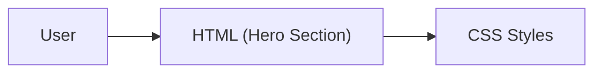

# SMIT Hero Section (Student Project)

This repository contains a simple hero section for a web page, created as a part of my beginner web development learning journey. The goal is to build and style a classic "hero" area using only HTML and CSS.

## Learning Objective

- Practice building a visually appealing hero section from scratch
- Understand how to use HTML elements for structure
- Learn CSS for layout and basic design
- Learn to use images in web projects

## Technologies Used

- **HTML5** — for page structure
- **CSS3** — for styling and layout
- Images — for a visual hero background

## Features

- Simple, centered hero section
- Image included in the design
- Responsive layout basics (if practiced)
- Organized folder for images

## Folder Structure

```
SMIT_Hero_Section/
├── image/
├── index.html
└── style.css
```

- `index.html` — Main web page file
- `style.css` — All CSS styling for the hero section
- `image/` — Contains image(s) used in the hero

## How to Open / Run the Project

1. Download or clone this repository.
2. Open `index.html` in your web browser.
3. See the hero section as it appears on the page.

No special setup required. Works in any modern web browser!

## Notes

- This project is for learning purposes only.
- The code is kept simple and easy for beginners to understand.
- You can try changing the image or styles to practice more!

## Future Learning Goals (optional)

- Explore more CSS properties for advanced effects
- Make the hero section fully responsive for mobile devices
- Add buttons or links to the hero area
- Try using gradients or multiple images

---

## Simple Architecture Diagram


